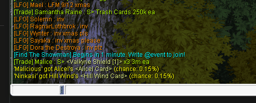

[](https://ko-fi.com/Z8Z7QWDNW)

# ::bokuno

Plugin System for Ragnarok Online

Bokuno is a custom plugin system that extends the capabilities of the Ragnarok Online client. Load custom plugins to add new features and enhance your gameplay.

## Core features
### ping
Type `/ping` into the chat box to see your ping to the server.



## Available Plugins

### Gamepad Support
Play Ragnarok Online with full gamepad support. Customizable button mappings for movement, combat, and skills.

### Auto Login
Automatically log in to your character with saved credentials.

---

## Installation
1. Download the BokuNo.zip package from [GitHub releases](https://github.com/foksikus/BokuNo/releases/latest/download/BokuNo.zip)

2. **Copy the Core DLL**: Place the `core` (renamed to `ddraw.dll`) into the root directory of your Ragnarok Online installation
   ```
   C:\Games\YourRagnarokFolder\ddraw.dll
   ```

3. **Copy Plugin Folder**: Copy the entire `plugins` folder containing both plugins `controller_support_plugin.dll` and `auto_login.dll` and some example configs into the Ragnarok root directory
   ```
   C:\Games\YourRagnarokFolder\plugins\
       └── controller_support_plugin.dll
       └── config_gamepad.json
       └── auto_login.dll
       └── config_auto_login.json
   ```
4. **Configure** the plugins for your use, or **remove** them if you dont want to use them.

5. **Launch Game**: Start Ragnarok Online normally. The controller support will load automatically.

---
# ::gamepad_support Plugin

A gamepad/controller plugin for Ragnarok Online that enables full controller support with customizable button mappings.

## Features

- **Full Gamepad Support**: Play Ragnarok Online with Xbox-style controllers
- **Movement Control**: Left thumbstick for character movement
- **Camera Control**: Right thumbstick for camera rotation
- **Customizable Button Mappings**: Configure any button to perform different actions
- **Skill Casting**: Use skills with configurable skill IDs and levels
- **Item Usage**: Quick-use items from your inventory
- **Target Selection**: Cycle through nearby enemies and auto-target closest mob
- **Attack Commands**: Attack selected targets with a button press

## Configuration

Edit `config_gamepad.json` to customize your button mappings. The configuration file uses a simple JSON structure:

```json
{
  "char_name": {
    "Buttons": {
      "BUTTON_NAME": {
        "action": "ActionType",
        "skill_id": 123,
        "item_id": 456,
        "level": 10
      }
    }
  }
}
```

### Available Buttons

- `A_BUTTON`
- `B_BUTTON`
- `X_BUTTON`
- `Y_BUTTON`
- `RIGHT_SHOULDER` (RB/R1)
- `LEFT_SHOULDER` (LB/L1)
- `RIGHT_THUMB` (Right stick click/R3)
- `LEFT_THUMB` (Left stick click/L3)

### Available Actions

#### `Interact`
Attack or Speak with the closest Target or the currently selected target, depending on the target Type.

**Parameters**: None

**Example**:
```json
"A_BUTTON": {
  "action": "Interact"
}
```

#### `Attack`
Attacks the currently selected target.

**Parameters**: None

**Example**:
```json
"B_BUTTON": {
  "action": "Attack"
}
```

#### `PickupItem`
Pick up closest item from the ground.

**Parameters**: None

**Example**:
```json
"Y_BUTTON": {
  "action": "PickupItem"
}
```

#### `UseSkill`
Casts a skill on yourself or a target (depending on skill type).
Casts on the currently selected target. If no target is selected, automatically selects the closest enemy.

**Parameters**:
- `skill_id` (required): The numeric ID of the skill
- `level` (required): The skill level to cast

**Example**:
```json
"B_BUTTON": {
  "action": "UseSkill",
  "skill_id": 50,
  "level": 10
}
```

*note: Ground skills are not supported yet.*

#### `UseItem`
Uses an item from your inventory.

**Parameters**:
- `item_id` (required): The numeric ID of the item

**Example**:
```json
"X_BUTTON": {
  "action": "UseItem",
  "item_id": 601
}
```

#### `NextTarget`
Cycle through nearby enemies.

**Parameters**: None

**Example**:
```json
"RIGHT_SHOULDER": {
  "action": "NextTarget"
}
```

#### `CenterCamera`
Resets the camera angle to 0 degrees (default view).

**Parameters**: None

**Example**:
```json
"RIGHT_THUMB": {
  "action": "CenterCamera"
}
```

## Example Configuration

```json
{
  "FokS": {
    "Buttons": {
      "A_BUTTON": {
        "action": "Interact"
      },
      "B_BUTTON": {
        "action": "UseSkill",
        "skill_id": 50,
        "level": 10
      },
      "X_BUTTON": {
        "action": "UseItem",
        "item_id": 601
      },
      "Y_BUTTON": {
        "action": "PickupItem"
      },
      "RIGHT_SHOULDER": {
        "action": "NextTarget"
      },
      "RIGHT_THUMB": {
        "action": "CenterCamera"
      }
    }
  }
}
```

## Controls

### in Charackter selection Screen
- **Left Thumbstick**: Move selection
- **D-Pad**: Move Selection
- **A Button**: Confirm
- **B Button**: Cancel

### in Gameplay
- **Left Thumbstick**: Move your character
- **Right Thumbstick**: Rotate camera
- **Buttons**: As configured in `config_gamepad.json`

### in NPC Dialog
- **D-Pad**: Move Selection
- **A Button**: Confirm/next/close
- **B Button**: Cancel

## Known Issues

- **Ground Skills:** Not supported yet - planned for future update
- **Gamepad Compatibility:** Only tested with Xbox Gamepads, other types may not work

---

# ::auto_login Plugin

Auto Login for Ragnarok Online

Seamlessly log into your Ragnarok Online account without manual input. Save time and enhance your gaming experience with the Auto Login plugin.

## Configuration

Edit `config_auto_login.json` to set your login credentials.

### Example

```json
{
    "username": "YourAccountName",
    "password": "YourPassword"
}
```

---

# Notes
- Skills are automatically categorized as self-cast or target-cast based on skill ID
- Target range for cycling is currently set to 7 cells
- The only controller used for testing was an Xbox-Controller. It's likely that other controller types **won't** work.
- **BokuNo** will **only** work on **MyRO**. 